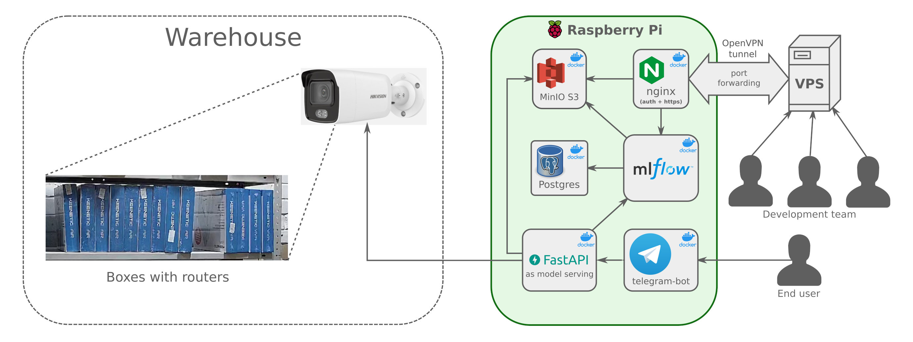

# Automated Stocktaking using computer vision (boxes with equipment)

**This is initial phase of the project. Please continued here:** https://gitlab.com/sergevv/ds-cv-boxes

Short description: chatbot that reports daily the actual availability of equipment in the warehouse (boxes with routers) using a video surveillance camera

- cv_boxes_v2.py - rectangles detection with a opencv-python https://pypi.org/project/opencv-python/
- cv_boxes_v2.ipynb - the same but as a notebook
- cv_boxes1.png - original screen from videocamera
- cv_boxes_mask.png - a mask for limit view to a shelf with boxes
- datasheet_dahua_ipc_b1b20.pdf - datasheet of applied ip-camera Dahua DH-IPC-B1B20, 2 Mp, 3.6 mm.

Features: Dahua camera behind gray ip. Dahua registrar in another location with white ip. Both points are on the same provider network. All routers are exclusively from Keenetic manufacturer in blue boxes. The trial counting was done only on screenshots made manually, but I had not yet mastered how to get them on a schedule (from a video or image).

An interesting implementation of a similar idea in real time: https://www.youtube.com/watch?v=nnLfb9tMbPE
